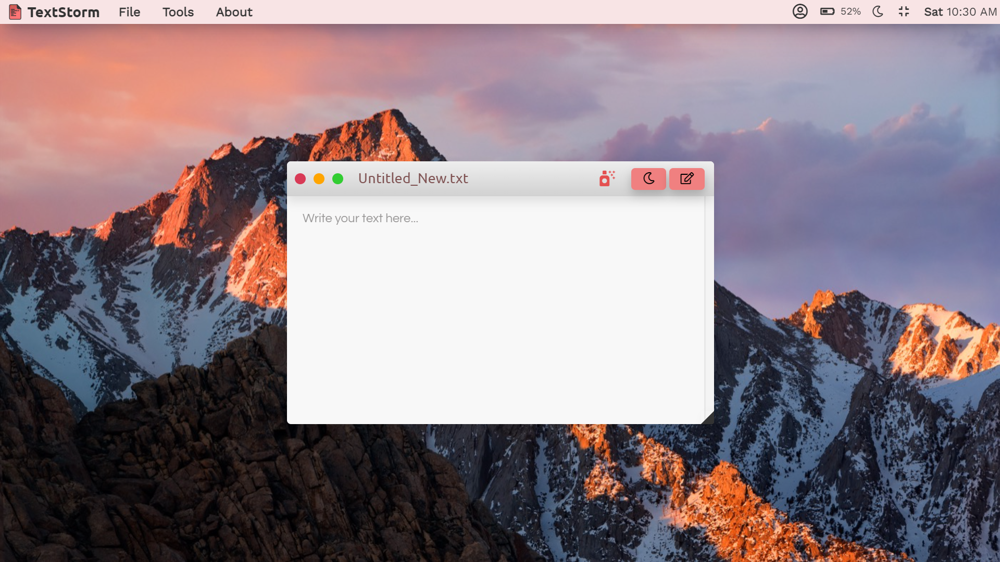

## &nbsp;<b>TextStorm 2.3.9</b>
 
#### &nbsp;A simple web text/notes editor with Mac UI/UX Design

### <b>Interface :</b>

 

### <b>Top Features</b>
- Desktop Feel
- Mac window type interface for easier output
- File Rename with custom file extentions
- Save file for half edited file in cloud
- Custom fonts for editing
- Editing/Viewing Mode feature for presentation

-> YOU WOULD BE GETTING MORE IDEA IF YOU START USING IT

 

### <b>Developer :</b>
[Dwijottam Dutta](https://github.com/Dwijottam-Dutta)

 

### <b>Contribute :</b>
For Contribution we have created a branch named 'Contribution' which you can fork down and then start contributing

Remember, you need to note down what all changes you have made, if we accept your contribution, as TextStorm is licensed under [Apache-2.0 License](https://choosealicense.com/licenses/apache-2.0/).

You can also take a help if you do not have much idea on how to contribute on github projects:

Check the site [here...](https://www.dataschool.io/how-to-contribute-on-github/)

 

### <b>Distribution :</b>
If you anytime want to use some part of code from TextStorm, and use it for your own, or want to make a clone of TextStorm and make it much better (also known as distribution) and want to publish that too. There is a some thing you need to do. If you want to do so you need to mention our [LICENCE](LICENCE), and the developer name in your third party License Section... And then you are free to use any part of code from our project from or else if we see that you have not mentioned it, then this mater can even got to court, that's why you need to take care of this...

 

### <b>License :</b>
TextStorm is licensed under [Apache-2.0 License](https://choosealicense.com/licenses/apache-2.0/). This would help and while you contribute to TextStorm

  
